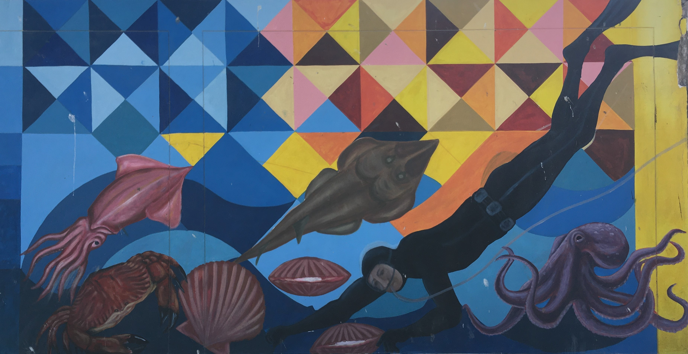

<!-- Background setup + creating datafile to work with -->


```{r setup, include=FALSE}
library(learnr) # tutorial mode
library(tidyverse) # data wrangling
library(igraph) # networks tools
library(ggraph) # network plotting
library(maps) # spatial mapping
library(visNetwork) # interactive network visualization
library(rnaturalearth) # world map data

# Define the species and social actors (nodes)
nodes <- c("Phytoplankton", "Scallops", "Zooplankton", "Predatory crabs", 
           "Octopus", "Marine mammals", "Small pelagics", "Demersal fish", 
           "Pelagic predatory fish", "Scallop farmers", "Diving fishers", 
           "Purse seine fishers", "Gill net fishers", "Longline fishers", 
           "Hand line fishers", "Local Markets", "Restaurants")

# Define the identity of each node (ecological or social)
identity <- c("ecological", "ecological", "ecological", "ecological", 
              "ecological", "ecological", "ecological", "ecological", 
              "ecological", "social", "social", "social", "social", 
              "social", "social", "social", "social")

# Define the functional role of each ecological node
type <- c("primary_producer", "primary_consumer", "primary_consumer", "secondary_consumer", 
                     "tertiary_consumer", "top_predator", "secondary_consumer", "secondary_consumer", 
                     "top_predator", "mariculture", "fisheries", "fisheries", "fisheries", "fisheries", "fisheries", "supply_chain", "supply_chain")


# Define the connections (edges) between the nodes with biomass flow
edge_list <- data.frame(
  from = c("Phytoplankton", "Phytoplankton", "Zooplankton", 
           "Scallops", "Small pelagics", "Small pelagics", 
           "Predatory crabs", "Demersal fish", "Demersal fish", 
           "Zooplankton", "Scallops", 
           "Octopus", "Small pelagics", "Demersal fish",  
           "Pelagic predatory fish", "Demersal fish", 
           "Scallop farmers", "Purse seine fishers", "Gill net fishers", 
           "Hand line fishers", "Local Markets"),
  to = c("Zooplankton", "Small pelagics", "Small pelagics", 
         "Predatory crabs", "Pelagic predatory fish", "Marine mammals", 
         "Octopus", "Marine mammals", "Pelagic predatory fish", 
         "Scallops", "Scallop farmers", 
         "Diving fishers", "Purse seine fishers", "Gill net fishers", 
         "Longline fishers", "Hand line fishers", 
         "Restaurants", "Local Markets", "Local Markets", 
         "Local Markets", "Restaurants"),
  biomass_flow = c(40, 20, 10, 3, 15, 10, 4, 7, 8, 
                   2, 3, 2.5, 12, 6, 7, 4, 
                   0.5, 2, 1.5, 0.8, 1)
)

# Create a dataframe for the nodes
node_list <- data.frame(nodes, identity, type)

# Create the network graph
g <- graph_from_data_frame(edge_list, directed = TRUE, vertices = node_list)

```

## Course introduction

<font size="4"> 

Welcome to the course on **Network Analysis in Social-Ecological Systems Research**.



This course will guide you through the steps of *building*, *analyzing* and *visualizing* networks using R. 

By the end, you'll be ready to apply network analysis to real-world social-ecological systems.

</font>


## R basics

### Getting started

Let's refresh our R skills by going through some basic exercises. 

---------------------

Run the R code below to add 2 plus 2. To get started, press the green "Run Code" button. You can then change the code, e.g. to calculate 3+3. Do that now and check the result below the code box. 

If you want to go back to the initial state, simply press the grey "Start Over" button above the code box. Try it out! Do you notice how it goes back to showing "2+2" in the code box?

```{r 1-1, exercise=TRUE}
2+2
```

In the R environment, we can use variables to keep track of data. Run the R code below to store the value 4 in "a" and 2 in "b". Then calculate a+b. 

Try adding a multiplication (a*b) and check the outcome.

```{r 1-2, exercise=TRUE, exercise.lines = 6}
a <- 4

b <- 2

a + b

```

A "vector" is a basic data structure in R. To create a vector (i.e. a list of numbers), we can use the c() command, referring to "concatenate" or "put together".

```{r 1-3, exercise=TRUE}

c(1,2,3,4,5,6)

```

We can also simply write 1:6, equally creating a sequence of numbers from 1 to 6.

```{r 1-4, exercise=TRUE}

1:6

```

Just as before, we can store this in a variable, such as "d", to use it at a later stage. To view the variable, simply type in d in the console. In case you get stuck, use the Hint button.

```{r 1-5, exercise=TRUE}

d <- 1:6

```

```{r 1-5-hint}

# Simply type "d" (without the quotation marks!) in the console to inspect the list.

```

We can then use some of R's built-in functions to calculate the mean, minimum and length of the list of numbers.

```{r 1-6, exercise=T, exercise.lines = 6}

d <- 1:6

mean(d) # calculates the mean
min(d) # minimum value in a list
length(d) # length of a list

```

Easy, right? We now want to create a matrix and inspect it. Note that we store the matrix in a variable called "adj". Can you imagine how this helps us to inspect the matrix?

We can then check how many rows and columns the matrix has using the ncol() (i.e. number of columns) and nrow() (i.e. number of rows) commands.

```{r 1-7, exercise=TRUE, exercise.lines = 6}

adj <- matrix(c(0,1,0, 1,0,0, 1,1,0), nrow=3, ncol=3, dimnames = list(c("Node1", "Node2", "Node3"), c("Node1", "Node2", "Node3")))

ncol(adj)
nrow(adj)

```

```{r 1-7-hint}

#Add adj below the existing code to inspect the matrix.

```

*Optional:* Take a pen and paper and draw the network that this matrix represents. (A value of 1 represents an existing link between two nodes, while 0 indicates no link between two nodes. There is, for example, a link between Node1 and Node2.)

- Is this a directed or an undirected network? How would the matrix look like if it was the other way around?

- Do you see how a matrix (detailing which elements are connected) can be easily translated into a visual representation of the network?

------------------

#### Exercise

Now it's your turn. Please 1) create a vector that runs from 1 to 25, 2) save it as "e" and 3) calculate its mean.

```{r 1-8, exercise=TRUE, exercise.lines = 5}

```

```{r 1-8-hint}

e <- 1:25
mean(e)

```

## Working with a network dataset

Usually we do not create matrices / data frames by hand in R (as with the previous matrix example), but instead import data from external files, e.g. from csv files. This can be done by loading a node list (listing all nodes of a network with their attributes) as well as an edge list (listing all connections between these nodes).

To load a dataset in R, you can use the command read_csv() and direct it towards the file location on your computer. For this exercise, this has already been done for you. To view the dataset, simply type in the name of the dataset "node_list".

```{r 2-1, exercise=TRUE, exercise.lines = 5}
# node_list <- read_csv("data/nodes.csv") 
# --> already done for you!


```

```{r 2-1-hint}

# Simply type in "node_list". Your code then looks like this:

node_list

```


After having inspected this dataset a bit, let's only view the nodes (without the additional information on identity and type of each node). For this we can use the $ command, which is used in R to specify a specific column of a dataframe. How many nodes does the dataset have?


```{r 2-2, exercise=TRUE}

node_list$nodes

```

We now want to subset the data, only keeping the ecological nodes (i.e. where the identity column says "ecological"). For this we can use the squared brackets [] to subset and "==", meaning "is equal to", to indicate a subsetting condition. How many nodes do we filter out with this? 

PS: Don't worry! As we do not overwrite node_list, we don't lose the rest of the dataset.

```{r 2-3, exercise=TRUE}

node_list[node_list$identity=="ecological",]

```

Now, let's only keep those ecological nodes that represent the functional role (= type) of top predators. For this, we can use the & sign. 

```{r 2-4, exercise=TRUE}

node_list[node_list$identity=="ecological" & node_list$type=="top_predator",]

```

In a next step, let's try subsetting the dataset for non-ecological actors (i.e. social actors). For this we can use the comparison operator "!=", meaning "is different from". 

In this simple case, we could also write =="social" as we do not have any other categories in the dataset.

```{r 2-5, exercise=TRUE}

node_list[node_list$identity!="ecological",]

```

```{r 2-5-hint}
# node_list[node_list$identity=="social",] would in this case also work :)
```

We have now inspected the node_list in detail, containing information about the individual components of the network. However, to create our first network we are still missing information on the connections between these components. This information is usually stored in a so-called "edge list" that lists all links between the nodes. So let's inspect the edge_list, which was already loaded for you.

```{r 2-6, exercise=TRUE, exercise.lines = 5}

edge_list

```

The edge list shows the directed links between nodes (column "from" to column "to") as well as a value for the biomass flow for each link.

With the node list and the edge list, we now have all the information we need to assemble the network.

-------------

### Exercises:

Which social actors are categorized in the node type "fisheries"? For this exercise, you can refer to the code above. Potentially you might have to inspect the dataframe node_list again.

```{r 2-7, exercise=TRUE, exercise.lines = 5}

```

```{r 2-7-hint}
node_list[node_list$identity=="social" & node_list$type=="fisheries",]
```

How many links are there between phytoplankton and other species groups?

```{r 2-8, exercise=TRUE, exercise.lines = 5}

```

```{r 2-8-hint}

# edge_list[edge_list$from=="Phytoplankton",]

# Besides simply inspecting this admittedly small dataset and counting, you can also use nrow() to calculate the number of rows in a (subsetted) dataframe.

```


## Visualizing networks with igraph

After revisiting some basic R knowledge, let's dive deeper into using R for network analysis and visualization.

-------------

There are different R packages for working with network data. A very versatile package is called "igraph". To use "igraph", we first have to transform our two dataframes (node_list and edge_list) into an igraph object. 

The code below does exactly this. Before running it, add the code snippet necessary to inspect it afterwards. You are already an R pro, so you probably don't need to look at the hint.

```{r 3-1, exercise=TRUE}

g <- graph_from_data_frame(edge_list, directed = TRUE, vertices = node_list)

```

```{r 3-1-hint}
#Simply type in "g" or alternatively "print(g)" and run the code.

# The graph is (D)irected and (N)amed. It has 17 vertices and 21 edges. It has three vertex attributes (v/c for vertex/character) called "name", "identity", and "type" and one edge attribute (e/n for edge/numberic) called "biomass_flow".

```

What does this output tell us? Feel free to discuss this with your colleagues.

So you see that there is already quite some information hidden in the igraph object.

------------

To use "functions" in R, such as the one above (graph_from_data_frame), the corresponding package has to be installed and loaded first. This can be done using R's built-in functions install.packages("insert_package_name") to install and library("insert_package_name") to load the packages. In this learning environment, this has already been done for you in the background. For reference, you can take a look at the respective code here:

```{r 3-2, exercise=TRUE}
#install.packages("tidyverse")
#library(tidyverse) # housekeeping

#install.packages("igraph")
#library(igraph) # networks tools

#install.packages("ggraph")
#library(ggraph) # network plotting

```

To plot an igraph object, we can use the "ggraph" package. Now, run the code below.

```{r 3-3, exercise=TRUE, exercise.lines = 7}

ggraph(g,layout="graphopt") +
  geom_edge_link() + # Draw edges
  geom_node_point(size=5, color="blue") + # Draw nodes
  theme_graph() # Set graph theme

```

**Congratulations, you just plotted your first network!**

-----------------

Let's do an experiment: Try running the same code several times.

----------------

```{r quiz, echo=FALSE}
quiz(
  question("What do you notice?",
    answer("Nothing", correct = FALSE),
    answer("The graph representation is changing, but the network structure remains the same", correct = TRUE),
    answer("It's a completely different network each time", correct = FALSE),
    answer("The nodes remain the same, but the connections are changing each time", correct = FALSE),      allow_retry = TRUE  # Allow users to retry the quiz
  )
)
```


## Network Visualization II

Let's up our game! 

We now want to color the nodes based on their "identity".

We thus modify the code as outlined below. Do you notice the difference?

```{r 4-1, exercise=TRUE, exercise.lines = 7,warning=FALSE}

ggraph(g, layout="stress") + 
  geom_edge_link() + # Draw edges / ties
  geom_node_point(aes(color=identity), size=5) + # Draw nodes setting identity as node color with a fixed node size
  theme_graph()

```


```{r 4-1-hint}

# To increase the node size, simply adjust the size parameter under geom_node_point (currently set at 5).

# You can try using different layouts such as "graphopt" or you search the web for other options :)

```

Let's try to increase the node size. Any ideas on how to do that?

<br>

In a next step, we want to adjust edge width based on the value in the biomass_flow column.

```{r 4-2, exercise=TRUE, exercise.lines = 7,warning=FALSE}

ggraph(g, layout="stress") +
  geom_edge_link(aes(width=biomass_flow),color="grey90") + # Draw edges and set size based on importance
  geom_node_point(aes(color=identity), size=7) +
  theme_graph()
```

In a last step, we add the ID label.

```{r 4-3, exercise=TRUE, exercise.lines = 7,warning=FALSE}
ggraph(g, layout="stress") +
  geom_edge_link() +  # Draw edges
  geom_node_point(aes(color = identity), size = 5) +  # Draw nodes with color by identity
  geom_node_text(aes(label = name), size = 3, repel = TRUE, color = "black") +  # Add labels with size and repel to avoid overlap
  theme_graph()  # Set graph theme

```

*Reflection:* What does the structure of this network tell us about the relationship between ecological components and social actors? What are key species or actors and what role could they play?

-----------------

To create an interactive version of the plot, we can use the "visNetwork" package. Plot the network and try clicking on one of the nodes. Then try moving the nodes around, zooming in/out and hovering above a node/link with your mouse.

```{r 4-4, exercise=TRUE, exercise.lines = 7,warning=FALSE, exercise.lines = 15}
# Prepare nodes with color and additional info for display
nodes_vis <- data.frame(id = node_list$nodes, label = node_list$nodes, title = paste("Node:", node_list$nodes, "<br>Type:", node_list$identity, "<br>Functional Role:", node_list$type), group = node_list$identity)  # Group nodes by identity for coloring

# Prepare edges with additional info for display
edges_vis <- data.frame(from = edge_list$from, to = edge_list$to, title = paste("From:", edge_list$from, "<br>To:", edge_list$to, "<br>Biomass Flow:", edge_list$biomass_flow))

# Visualize the network
visNetwork(nodes_vis, edges_vis) %>%
  visNodes(shape = "dot", font = list(size = 20)) %>%
  visEdges(arrows = "to") %>%
  visOptions(highlightNearest = TRUE, nodesIdSelection = TRUE) %>%
  visGroups(groupname = "ecological", color = "lightblue") %>%
  visGroups(groupname = "social", color = "orange")


```


## Network metrics

In network analysis, there are various ways to "measure" the importance of nodes and their connectivity. Two key metrics are called "degree centrality" and "betweenness centrality", which quantify how well-connected or influential individual nodes are within the network.

Let’s explore these metrics by calculating them for the nodes in our network.

**Inspecting Nodes and Edges**

First, we can look at the nodes and edges of our network using V() for vertices (nodes) and E() for edges (links). This will give us an overview of all the components in our network g.

```{r 5-1, exercise=TRUE}

V(g)  # Display all nodes (vertices) in the network
E(g)  # Display all edges (links) in the network

```

**Degree centrality** is a measure of how connected a node is in the network. A node with a higher degree centrality is connected to more other nodes, and therefore might play a key role in the system. 

Let's calculate the degree centrality for all the nodes in our network g.

```{r 5-2, exercise=TRUE}

# Calculate degree centrality for all nodes

degree(g)

```

**Betweenness centrality** measures how often a node lies on the shortest path between other nodes. In other words, a node with high betweenness centrality may act as a "bridge" between different parts of the network. In a social-ecological system, this could represent an actor or species that "controls" the flow of biomass (e.g., a key prey species linking different parts of the foodweb or a central social actor like a market).

```{r 5-3, exercise=TRUE}

# Calculate betweenness centrality
betweenness(g)

```

Interpretation: Discuss with your neighbors/colleagues about what the degree or betweenness centrality of a node tells you about it's role in a social-ecological system. Can you come up with examples related to your own work?

<br>

**Social-Ecological System Metrics**

For a social-ecological system, we can focus on more specific metrics to understand how e.g. biomass flows between ecological and social nodes.

- Cross-System Links: These are the connections between ecological and social nodes, representing the flow of biomass from one domain to the other.

- Total Biomass Flow: This sums the biomass that flows from ecological nodes to social ones, giving insight into how much of the ecosystem’s resources are being used by social actors.

- Interaction Density: This measures the overall connectivity of the system by looking at the ratio of edges to the total number of nodes.

```{r 5-4, exercise=TRUE, exercise.lines = 17}
# Identify ecological-to-social edges (cross-system)
edge_list$from_identity <- node_list$identity[match(edge_list$from, node_list$nodes)]
edge_list$to_identity <- node_list$identity[match(edge_list$to, node_list$nodes)]

# Filter for edges where 'from' is ecological and 'to' is social
cross_system_edges <- edge_list[edge_list$from_identity == "ecological" & edge_list$to_identity == "social", ]

# Count number of cross-system edges
nrow(cross_system_edges)

# Calculate total biomass flow from ecological to social nodes
sum(cross_system_edges$biomass_flow)

# Calculate interaction density (total edges / total nodes)
length(E(g)) / length(V(g))

```

*Reflection:*
Think about what this metrics might mean in the real world? For example, think about the role of high biomass flows of a resource to certain social actors (i.e. reliance on a single species), potentially making them more vulnerable to shifts in the ecological system.

---------------

*Bonus challenge:* Community detection algorithms

Community detection helps identify clusters or sub-groups within the network. These sub-groups can reveal how tightly interconnected certain species or actors are, or highlight distinct communities in the network that may interact more closely within their group than with others.

```{r 5-5, exercise=TRUE, exercise.lines = 14, warning=FALSE}
# Detect communities using the Walktrap algorithm
communities <- cluster_walktrap(g)
memberships <- membership(communities)

# View the communities
memberships

# Visualize the communities by color
ggraph(g, layout = "stress") +
  geom_edge_link(aes(width = biomass_flow), color = "grey90") +
  geom_node_point(aes(color = as.factor(memberships)), size = 7) +  # Color nodes by community
  theme_graph()

```

```{r 5-5-hint}

# If you want, you can explore different community detection algorithms (e.g. Infomap) to see how they compare.

# Use geom_node_text in addition to geom_node_point :)

```

*Reflection:* Examine the network plot with the community detection applied. How do the communities reflect interactions between different groups (e.g., between social and ecological actors)? How might this inform resource management decisions? Hint: For this exercise, it might help to add labels to the nodes (see previous code).


## Mapping in R

Many social-ecological networks have spatial dimensions, where interactions occur across geographic locations. To explore this, we can overlay key nodes on a map to visualize how social actors and ecological network components are spatially distributed (e.g. fishing grounds, habitats, landing sites, markets). 

Using the "map" package, we can easily create country maps. Run the code below and in a next step, try plotting a map of Austria.

(Another good option is the "rnaturalearth" package in combination with "ggplot", ask me for access to a separate tutorial on this one :) )

```{r 6-1, exercise=TRUE, exercise.lines = 5}

# library(maps) <- Already done for you!

# Create a country map for Peru
map("world", regions = "Peru", col = "grey70", fill = TRUE)

```

We can then plot locations as dots on the map.

```{r 6-2, exercise=TRUE, exercise.lines = 5}

map("world", regions = "Peru", col = "grey70", fill = TRUE)
points(x=-77.0428, y=-12.0464, pch=21, cex=2, col="black",bg="orange")
text(x =-77.0428, y =-12.0464, labels = "Lima", pos = 2, cex = 0.8)

```

And we can indicate connections between these places, creating a spatial network. 

For this exercise, we use the example of the Galapagos-Cocos swimway in the Eastern Tropical Pacific. Take a close look at the code below and try to understand what each line of code does.

```{r 6-3, exercise=TRUE, exercise.lines = 24, fig.width=10, fig.height=8}

# Define coordinates for some well-known marine protected areas in the Eastern Tropical Pacific.

lat <- c(-0.9538, 5.5185, 4.003, 8.5286, 7.5183)  # Latitudes for Galapagos, Cocos, Malpelo, Corcovado, Coiba
long <- c(-90.9656, -87.0739, -81.6017, -83.595, -81.7597)  # Longitudes for Galapagos, Cocos, Malpelo, Corcovado, Coiba
locations <- c("Galapagos", "Cocos Island", "Malpelo", "Corcovado", "Coiba")

# Plot the map of the world focusing on the Eastern Tropical Pacific region
map("world", regions = c("Galapagos", "Costa Rica", "Colombia", "Ecuador", "Panama", "Peru", "Brazil"), col = "grey70", fill = TRUE, 
    xlim = c(-93, -70), ylim = c(-6, 10.5))  # Adjust xlim and ylim to zoom in on region of interest

# Add text labels for each location
text(x = long, y = lat, labels = locations, pos = 4, cex = 1.1)

# Draw lines between the locations, representing the connectivity between the marine protected areas.
lines(x = c(long[1], long[2]), y = c(lat[1], lat[2]), col = "steelblue", lwd = 2)  # Galapagos to Cocos Island
lines(x = c(long[2], long[3]), y = c(lat[2], lat[3]), col = "steelblue", lwd = 2)  # Cocos Island to Malpelo
lines(x = c(long[2], long[4]), y = c(lat[2], lat[4]), col = "steelblue", lwd = 2)  # Cocos Island to Corcovado
lines(x = c(long[3], long[5]), y = c(lat[3], lat[5]), col = "steelblue", lwd = 2)  # Malpelo to Coiba
lines(x = c(long[1], long[3]), y = c(lat[1], lat[3]), col = "steelblue", lwd = 2)  # Galapagos to Malpelo

# Add points for each location again to ensure visibility
points(x = long, y = lat, pch = 21, cex = 2, col = "black", bg = "orange")

```

*Reflection:* How are geographic proximity or distance between nodes (e.g., between marine protected areas, or between fishing grounds and markets) relevant for the social-ecological system (for example in terms of system resilience)?

--------

*Optional pen & paper / R exercise*: How would a map look like that connects marine habitats with fisheries landing sites? Think about how the R code for this could look like.

--------

**Wonderful, we did it! :)**


## Wrap-Up and next steps

Well done! You are already a network professional :) You've built, visualized, and analyzed a network representation of a social-ecological system using R, and explored various network metrics. I am sure you now can't wait to start your own network study! :)

*Optional:* Think about and discuss with the people around you how you could use network analysis tools in your field of interest. How could a potential network look like in your area of work? Which questions could you tackle? Take pen and paper and sketch such a network. What do the nodes and edges represent? If you usually work with ecological data, try building a network that links the ecological system with the human dimension.

Of course, you are more than **welcome to revisit this material** as you progress, and **please reach out in case you want to discuss** your data or have a network project idea in mind! :)

-----------------------

  **Michael Kriegl**
  
  Leibniz Centre for Tropical Marine Research (ZMT)

  Email: **michael.kriegl@outlook.com**
 
-----------------------


If you want to dive deeper into network visualization, check out this webpage: https://kateto.net/network-visualization

------------------------

To learn more about social-ecological networks, check out these publications:

* Kluger, L. C., Gorris, P., Kochalski, S., Mueller, M. S., & Romagnoni, G. (2020). Studying human–nature relationships through a network lens: A systematic review. People and Nature, 2(4), 1100-1116.

  https://besjournals.onlinelibrary.wiley.com/doi/full/10.1002/pan3.10136


* Felipe-Lucia, M. R., Guerrero, A. M., Alexander, S. M., Ashander, J., Baggio, J. A., Barnes, M. L., ... & Dee, L. E. (2021). Conceptualizing ecosystem services using social–ecological networks. Trends in ecology & evolution.

  https://www.sciencedirect.com/science/article/pii/S0169534721003177
  
------------------------

For a fun and engaging introduction into social-ecological network analysis, check out this Frontiers for Young Minds article:

* Kriegl, M., Kochalski, S., Straka, T.M., Gorris, P., Schlüter, A. & Kluger, L.C. (2024). Our Blue Planet: Connecting Humans and the Ocean. Frontiers for Young Minds. 12:1076771.

  https://kids.frontiersin.org/articles/10.3389/frym.2023.1076771


----------------

You can also explore real-world case studies as these one's here:

* Kluger, L. C., Scotti, M., Vivar, I., & Wolff, M. (2019). Specialization of fishers leads to greater impact of external disturbance: Evidence from a social–ecological network modelling exercise for Sechura Bay, northern Peru. Ocean and Coastal Management, 179, 104861.

  https://www.sciencedirect.com/science/article/abs/pii/S0964569119301218

* Gonzalez-Mon, B., Bodin, Ö., Lindkvist, E., Frawley, T.H., Giron-Nava, A., Basurto, X., Nenadovic, M. & Schlüter, M. (2021). Spatial diversification as a mechanism to adapt to environmental changes in small-scale fisheries. Environmental Science & Policy, 116, 246-257.

  https://www.sciencedirect.com/science/article/pii/S1462901120313861

------

Thank you for participating in this **Social-Ecological Network Analysis** course! I hope you enjoyed it and learned a lot! :)
